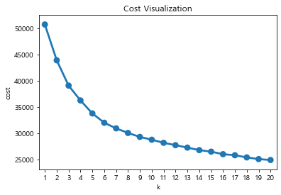
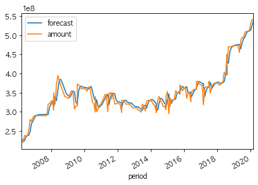

# 모델링 순서

## 1\. 클러스터링

### K-Prototype Clustering

#### 과정

  - 초기에 K-Means 클러스터링 알고리즘 고려했다, 그러나
    1)  연속형 + 범주형 변수가 섞여있는 데이터
    2)  범주형 변수를 지시 변수화할 경우 차원이 증가
    3)  PCA를 통해 차원을 축소할 수 있지만, 추가적인 과정이 비효율적
    4)  연속형과 범주형 변수를 형태 그대로 적용할 수 있는 K-Prototype 알고리즘 사용

#### 거리 함수

  - K-Prototype 알고리즘은 아래와 같이 거리 함수를 설정하며, 집단의 모든 자료로부터 가장 거리가 짧은 중심점을
    기준으로 자료를
군집화합니다.


#### API

  - K-Prototype 알고리즘은 아래와 같이 K의 개수, 초기값 설정, 그리고 범주형 변수의 숫자 순서를 지정해야합니다.

<!-- end list -->

``` python
from kmodes.kprototypes import KPrototypes
model = KPrototypes(n_clusters=k, random_state=0)
cluster = model.fit_predict(train, categorical=cate_variable_number)
```

#### K 선택

  - 1부터 20개의 k에서 Cost가 어떻게 변화하는지 측정
  - Elbow-Method를 적용하여 기울기의 변동률이 10% 미만으로 떨어지며 클러스터 수가 작은 값을 적당한 k라고
    정의합니다.
  - 수집된 데이터 상에는 11개의 클러스터가 적당한 것으로 판단되었습니다.



## 2\. 시계열 예측

  - ARIMA 모델 적용
      - 사용자가 직접 아파트와 면적을 입력하면 해당 input에 해당하는 시계열 예측 진행
      - 아파트 거래의 경우에는 날짜마다 항상 거래가 존재하는 것이 아니어서 상당 수의 결측치 발생
      - 이와 같은 결측치 문제를 해결하기 위해 앞선 K-Prototype 알고리즘으로 속성이 비슷한 아파트끼리 군집화한
        후, 사용자가 입력한 아파트가 속한 군집 내 아파트 가격의 Q1, Q2, Q3를 구하여 sample의 수를 늘려
        결측치를 없애는 방안을 시도
      - 위 세 변수로 지정하여 VAR 시계열 알고리즘을 진행했지만,
        1)  군집 내 가격의 변동차가 존재하여 분산이 커지는 문제점 발견
        2)  이와 같은 이유로 시계열 분석을 진행했을 때 예측값과 실제값의 큰 괴리 발생
      - 이에 따라 ARIMA 시계열 모형을 사용하기로 결정
      - 사용자의 input에 따른 아파트 가격에 결측값이 존재할 시, 선택된 아파트가 속한 cluster에 존재 하는 다른
        아파트의 가격들로 결측치를 직접 대치하는 방법을 고안
      - 분산을 최소화하기 위해 한 결측값을 기준으로 이전 날짜의 가격과 다음 날짜의 가격 사이에 있는 값들 중에서 Q3
        값을 사용
          - 예) 2019년 1월 은마아파트의 가격이 5억이고, 2019년 3월 은마아파트의 가격이 5억 5천이며,
            2019년 2월 은마아파트의 거래가 없어 가격이 NA일 때, 이를 채우기 위해 우선적으로 은마아파트가 속한
            cluster를 찾고, cluster 내 2019년 2월에 거래가 일어났고, 그 거래액이 5억과 5억 5천
            사이에 있는 아파트들의 Q3값을 찾아서 대체
      - 결측치가 사라진 데이터를 통해 Auto-regressive 모형과 moving-average 모형을 합친 ARIMA
        모형을 사용하여 최종적인 결과 예측



``` python
from statsmodels.tsa.arima_model import ARIMA
model = ARIMA(train, order=(0,1,1))
model_fit = model.fit(trend='c',full_output=True, disp=False)
predict_month = int(input("몇 개월 앞을 예측하십니까?"))
fore = model_fit.forecast(steps=predict_month)
```

  - 결과
      - 실제 데이터와 예측한 값의 괴리가 커지는 것을 확인할 수 있다.
      - 우선 아파트의 경우에는 random 하게 결측치가 존재하고, 이를 다른 sample로 부터 채워넣는 방식을 채택했기
        때문에, train/test 데이터를 정확하게 나누고 검증을 하는 데 있어서 모델링이 정교하지 못하였다.
      - 또한, 각 아파트마다 변수들과 속성이 다르기 때문에 절대적인 p,q,d 값을 설정할 수 없다. 앞선 아파트에는
        p=0,q=1,d=1로 설정하였지만, 다른 아파트도 이와 같은 parameter를 갖는다고 단정할 수 없다. 이와
        같은 이유 때문에 auto\_arima라는 모델링을 고안하였다.
      - Auto\_arima 모델링을 진행하였을 때, 따로 parameter를 설정하지 않아도 자동으로 처리가 되어 앞선
        arima 모델에서 야기되었던 문제점을 어느정도 해결할 수 있었다. 실제로 성능이 조금 좋아진 것 역시 확인할 수
        있다.
      - 본래는 이와 같은 Auto\_arima 모델을 사용하려고 했지만, 다음의 이유로 인해 이전 방법인 ARIMA 모델을
        다시 사용하게 되었다.
      - 몇개월 후의 아파트 가격을 예측하기로 사용자가 설정을 하고 shell을 실행하였을 때, auto arima의
        경우에는 시간이 상당히 많이 소요되는 것을 확인할 수 있었다. 이와 같은 이유로 성능과 속도의
        tradeoff가 발생하여, 조원끼리 상의하여 속도를 선택하는 쪽으로 진행하기로 결정하였다.
      - 이에 따라 결국 ARIMA 모델을 선택하였지만, 향상도 측면에서 개선해야할 부분들이 많이 있다. 추후 성능을 높이기
        위한 다른 방법의 고안이 필요하다.
